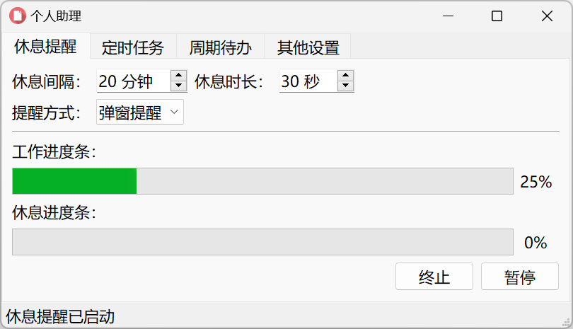

# 个人助理应用
> 让生活简单一点的个人助理应用


<p>
  <a href="https://raw.githubusercontent.com/songquanpeng/personal-assistant/main/LICENSE">
    
  </a>
  <a href="https://github.com/songquanpeng/personal-assistant/releases/latest">
    
  </a>
  <a href="https://github.com/songquanpeng/personal-assistant/releases/latest">
    
  </a>
</p>

可在 [Release 页面](https://github.com/songquanpeng/personal-assistant/releases)下载最新版本（Windows，macOS，Linux）。

## 功能
1. 休息提醒，包含多种提醒方式：消息提醒、弹窗提醒以及显示桌面。
2. 定时任务，定时执行各种命令。
   1. 内置命令 `@tray` 可用于定时发送系统消息。
   2. 内置命令 `@msg` 可用于定时通过 [Message Pusher](https://github.com/songquanpeng/message-pusher) 发送消息（需要在`其他设置`页面配置好 Message Pusher 的服务地址和 token）。
   3. 内置变量 `@day` 和 `@weekday` 可直接使用。
   4. 语法：`weekday hour minute command`，例如：
      1. `* 11 30 @msg 订外卖`：每天 11:30 提醒订外卖；
      2. `4 8 0 @msg 订球场`：每周四 08:00 提醒订球场；
      3. `* 22 0 python ./backup.py`：每天 22:00 执行备份脚本；
      4. `* 9,13,17 0 @msg 记得滴眼药水~`：每天三个时间点提醒滴眼药水；
      5. `* 3,12,18 0 scp username@ip:path/to/file ./day-$day.db`：每天三个时间点自动备份数据到本地。
3. 周期待办，自动添加待办事项。
   1. 使用 pyautogui 操作本机的 Microsoft To Do，因此需要你已经安装并配置好了该应用。
   2. 应用将在凌晨三点自动添加今日待办，所以如果要使用本功能，电脑是不能关机的。
   3. 语法：`weekday task`，例如：
      1. `* 今日刷题`：每天添加任务 `今日刷题`；
      2. `4 订球场`：每周四添加任务 `订球场`；
4. 应用可以设置开机启动，并启动时自动打开休息提醒。

## 截图展示


## 使用方法
### Windows 用户  
直接双击 personal-assistant.exe 运行。

### macOS 用户
1. 给执行权限：`chmod u+x personal-assistant-macos`；
2. 之后直接双击运行 personal-assistant-macos 或在终端中运行都可。

### Linux 用户
同上，区别在于文件名换成 `personal-assistant`。

## 打包流程
```bash
pip install -r requirements.txt
pyuic5 -o ui.py main.ui
pyrcc5 -o resource_rc.py resource.qrc 
pyinstaller --noconsole -F ./main.py --icon icon.png -n personal-assistant.exe
```
